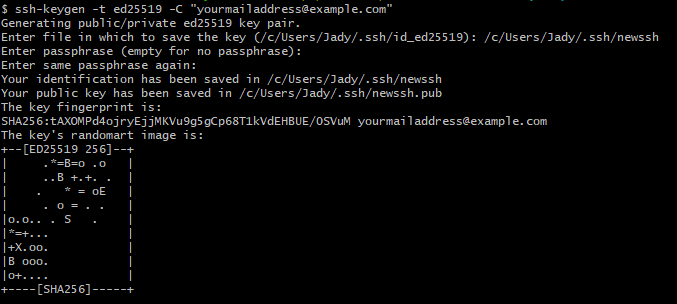

* TOC
{:toc}

# What is an access token ?
According to wikipedia :
> In computer systems, an access token contains the security credentials for a login session and identifies the user, the user's groups, the user's privileges, and, in some cases, a particular application.

So basically, it's a kind of **password system** but generalized to an whole entity. It helps applications to create sessions by using third party authentication credentials, for example.

# What is git ?
Git is a solid versioning system mainly used in IT, in order to handle files history and applications deployment. There are many related platforms in the industry, but I will only talk about **Github** and **Gitlab** here.

# Motivation
If you are new to git, this article is made for you. Since [github stopped using password-based SSH authentication](https://github.blog/changelog/2021-08-12-git-password-authentication-is-shutting-down/){:target="_blank"}, it may be difficult for newbies to connect to their github account from their PC. Let's start.

# Prerequisites
This article assumes that you :
- have installed [git CLI](https://git-scm.com/downloads){:target="_blank"}
- already have created an empty repository in your [github](https://docs.github.com/en/get-started/quickstart/create-a-repo){:target="_blank"}/[gitlab](https://docs.gitlab.com/ee/user/project/working_with_projects.html#create-a-project){:target="_blank"} account
- have a local folder that you want to push to your remote repository.

# Steps
## 1. Open your git CLI to generate your SSH keys
No matter what folder you are in, just write down this code in your git CLI **to generate a brand new access token** :


ssh-keygen -t ed25519 -C "yourmailaddress@example.com"


With changing the mail address to yours, of course.

You will afterwards have all the messages below.   
For the next lines, **all you need to do is to press enter**.  

*Note : In this example, I specified the name of my generated ssh keys to `newssh` because I already have `id_ed25519` file in store. In your case, you don't have to rename it.*
 
## 2. Verify your generated SSH keys
Check out the `/C/Users/yourusername/.ssh/` folder to make sure that your ssh keys are properly generated. You should have generated two files : `id_ed25519` and `id_ed25519.pub`.


## 3. Add the access token to your local machine
Before next step, you need to make sure that ssh-agent service in your local machine is on. To do so, execute the following line code in your git CLI :


eval "$(ssh-agent -s)"


This should give you a PID number, as follows : 


And now add it to your machine with the following script :


ssh-add ~/.ssh/id_ed25519


*Note : in my case, I replaced `id_ed25519` with my file name, which is `newssh`.*

Now let's share your public token.

## 4. Store access token remotely
<details markdown=block>
<summary markdown=span><strong>In github</strong></summary>
- Go to    
- Click on  then on 
- Add a relevant **title** to your SSH key, and paste the **whole content of your `id_ed25519.pub`** local file.

- Save it by clicking on **Add SSH key**.

You are ready to push files !
</details>

<details markdown=block>
<summary markdown=span><strong>In gitlab</strong></summary>
- Go to , then 
- Add a relevant **title** to your SSH key, and paste the **whole content of your `id_ed25519.pub`** local file.
- Additionally, you can add an **expiration date**. In my case, I will leave it blank.

- Save it by clicking on **Add key**.

You are ready to push files !
</details>

## 5. Test your SSH keys
You can test your SSH keys by pushing your local files to your remote repository. To do so, open your git CLI in the folder that you want to push, and execute these lines :

echo "# test" >> README.md
git init
git add README.md
git commit -m "first commit"
git branch -M main
git remote add origin https://github.com/yourusername/yourrepo.git
git push --set-upstream origin main

And you should have the following results :   


And next time you will commit local files, just use ```git push``` without defining the upstream branch.

That's all folks !

<!--# Bonus
You can also learn how to [push your files into two (or more) remote repositories](#todo).
-->


