* TOC
{:toc}

# Introduction

You probably want to create your own ReactJS application, and host it somewhere on a cloud-based solution afterwards. Depending on your final needs, there are a lot of app-hosting platforms like **[Vercel](https://vercel.com/){:target="_blank"}**, **[Heroku](https://www.heroku.com/){:target="_blank"}**, **[Netlify](https://www.netlify.com/){:target="_blank"}** and so on. But today, let me prove you that **[Gitlab](https://Gitlab.com/){:target="_blank"} is** also **a great React JS app hosting platform**.

# What is a react JS app ?
A react JS app is a **[user-friendly](#1-user-friendly)** **[web-based](#2-web-based)** application where everything is pretty much **[fast to load](#3-fast-to-load)**.

## 1. User-friendly
It doesn't matter the device, the resolution, the browser, or even the internet provider : the inner app features will always work properly, even if [it may not look the same](http://dowebsitesneedtolookexactlythesameineverybrowser.com/){:target="_blank"}.

## 2. Web-based
React framework renders HTML **components**, using Javascript. The final outputs are **HTML**, **CSS** and **JS** files. The main advantage is that a react JS app is a [Progressive Web App](https://en.wikipedia.org/wiki/Progressive_web_application){:target="_blank"} (PWA) that is installable as a native app, just by adding it at user's home screen.

## 3. Fast to load
A react JS app **only re-renders relevant components** on each user's actions, instead of reloading the whole html document like a basic webpage.

# The hosting solution
As stated at the [introduction](#introduction), we will use **Gitlab** as our web-hosting solution. You can check out what Gitlab is and why I have chosen it in my [Github vs Gitlab article](/why-Gitlab-is-sometimes-better-than-Github){:target="_blank"}.

Basically, we will use Gitlab to **handle 3 processes** :
1. [store our code][store]
2. [deploy our app to Gitlab pages][deploy]
3. [host our web-app endlessly][host]

# Why this method is better than others (**a must read**)
I have seen a lot of solutions using Gitlab CI/CD ([here][here1]{:target="_blank"}, [here][here2]{:target="_blank"}, and **even in Gitlab docs itself** [here][here3]{:target="_blank"}), **but** the main problem is this : they all build the app on Gitlab runners, which **consumes a lot your monthly CI/CD quotas** (**400 minutes/month** in **August 2022**), especially if you push your code frequently like me.   
For example, my quota almost run out because of a react JS app that <u>consumed a half of it in less than 1 week</u> of code :   
[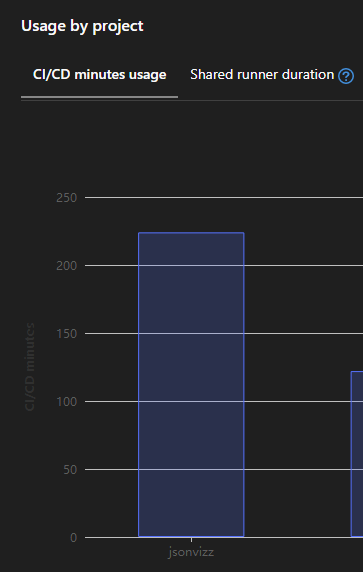](https://jsonvizz.jadynekena.com){:target="_blank"}

The following solution is to **build the app locally**, and to **deploy the already built app** remotely. That **consumes 9x less than common solutions** that I have found (20 seconds VS 3 minutes on average).

You can check out more advantages of this method [down below](#advantages-of-this-hosting-method).

# What you will need
This article assumes that you :
- already have a [Gitlab account][Gitlab account]{:target="_blank"} 
- installed [git CLI](https://git-scm.com/downloads){:target="_blank"} in your machine
- installed [npm](https://www.npmjs.com/){:target="_blank"} in your machine
- are familiar to creating and developping a [React JS app][React JS app]{:target="_blank"}

Let's dive into it !

# Steps
## 1. Create Gitlab repo
Go to [Gitlab](https://gitlab.com){:target="_blank"} and create a new blank project :
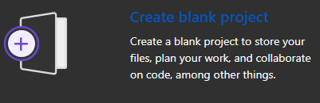

Set the **Project name**, **Visibility Level**, **Project Configuration** to whatever you want. Just make sure that **Project deployment target** is optionally set to **Gitlab Pages**, and do not change **Project slug** :
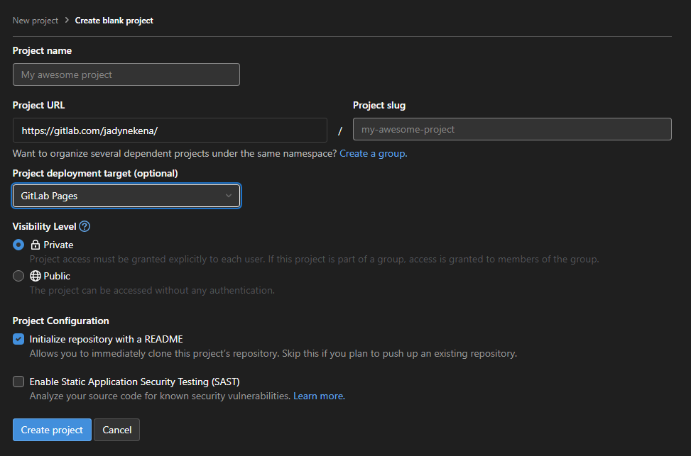

## 2. Clone the repo to your local machine
Open your git CLI from any folder, and clone the project that you've just created.

git clone https://gitlab.com/yourusername/nameofyourproject.git
cd nameofyourproject


> To link your local machine to your Gitlab account, check out this [dedicated article](/how-to-create-access-token-to-push-files-to-Github-or-Gitlab){:target="_blank"}

## 3. **Create react JS app and change `.gitignore` and `package.json` files**
### a) App creation
Now that you are in the repo folder, you can init your react app by using the following git command, where `apps` is the name of my app :

npx create-react-app apps


Let it run until you have this message :
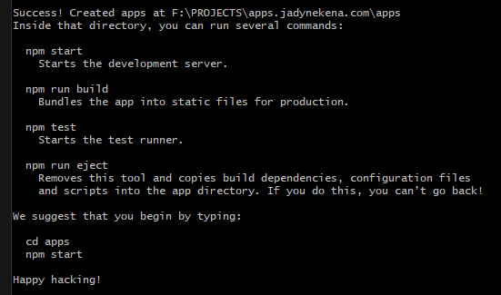

### b) **Files to change**
#### `.gitignore`
Open the app folder with `cd apps` command in git CLI.   
Edit the `.gitignore` by **deleting or commenting** the `/build` line :
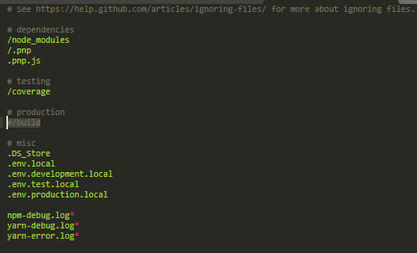   

#### `package.json`
Now change the `package.json` file by adding the following key-value pair:

{
...
"homepage": "https://yourusername.gitlab.io/nameofyourproject"
...
}


Your `package.json` file should now look like this.   
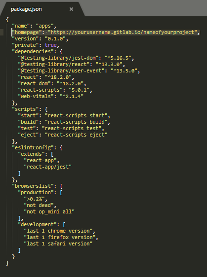

## 4. Build the app
Build the app with the following commands :

npm run build


> Optional step : run `npm run start` to see your app in dev mode before running `npm run build`. This will open [http://localhost:3000](http://localhost:3000){:target="_blank"} in your default browser.

You will afterwards see a **new folder named `build`** in your `apps` directory.
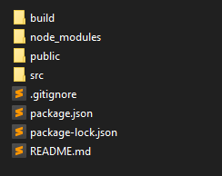

## 5. **Create .gitlab-ci.yml file for CI/CD**
In `apps` directory (i.e the folder where the `package.json` file belongs to), add the following content to a file named `.gitlab-ci.yml` :

pages:
  image: alpine:latest
  stage: deploy
  variables:
    GIT_STRATEGY: clone        # Do clone git repo
  script:
    - rm -rf public
    - cp build/index.html build/404.html # only one page for the app
    - mv build public         # Rename the CRA `build` folder to `public`    
  artifacts:
    paths:
      - public


### In summary
This file must be the most important part of this article. Gitlab needs this `.gitlab-ci.yml` file to handle the CI/CD of your project. Once this file exists **in the root of your repo**, Gitlab opens a **runner that will execute the config file** step by step.

### In details
- `pages:` the **job name** that will be executed. The specific job name **pages** is innerly recognized by Gitlab as **a step before Gitlab Pages Deployment**.
- `image: alpine:latest` Gitlab runner uses a Docker image of a small linux OS. It's like **turning on the computer** with always the latest version of the OS.
- `stage: deploy` it specifies that `deploy` job depends on the current one, so there will be **no Gitlab Pages Deployment as long as the current one is not done**.
- `GIT_STRATEGY: clone` the Gitlab runner **clones the whole current repo** into its own just created environment. It's like [what you've just done before](#2-clone-the-repo-to-your-local-machine).
- `script: ` everything under this block is **what is runned on Gitlab runner**. The script content in our file does the following steps :
	+ `rm -rf public`: **deletes** public folder (with forcing)
	+ `cp build/index.html build/404.html`: makes a **copy** of `index.html` file into `404.html` file so that **any other route that final user enters is fakely redirected to `index.html`**
	+ `mv build public`: rename `build` folder to `public`. **Gitlab Pages needs a folder named** `public` to identify the files that it will need to serve.

## 6. Move all react app files to root directory
You can move all files manually, or via terminal from your `apps` folder as follows :

cd ..
mv apps/* .
mv apps/.gitignore .gitignore
mv apps/.gitlab-ci.yml .gitlab-ci.yml
rm -rf apps


Make sure to :
- **turn off your local server** before proceeding
- **close all related terminal** before proceeding
- move **ALL** files, including `.gitignore` and `.gitlab-ci.yml`
- delete `apps` folder, as it is now empty we don't need it anymore.

Now your local repo `nameofyourproject` should look like this :   
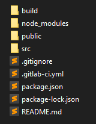

## 7. Push files to Gitlab
Back to your terminal, let's push it to gitlab.

git add .
git commit -m "first react app on gitlab pages"
git push

> To link your local machine to your Gitlab account, check out this [dedicated article](/how-to-create-access-token-to-push-files-to-Github-or-Gitlab){:target="_blank"}

## 8. Check out pipelines and jobs
Now go to your **Gitlab pipelines** : `https://gitlab.com/yourusername/nameofyourproject/-/pipelines` and see the current pipeline running :   
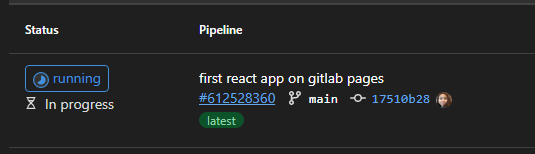

Once done, it will look like this :   
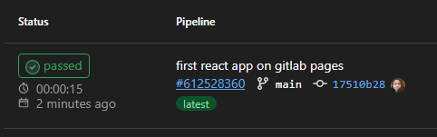

## 9. Change Gitlab Pages Visibility
Your app is almost ready, hang on a little longer !   
To make your website publicly available, navigate to your project's **Settings** > **General** > **Visibility** and select **Everyone** in pages section. <u>Don't forget to</u> **<u>save changes</u>**.   
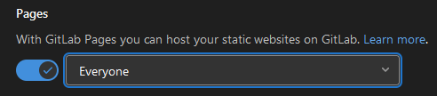

## 10. Preview your app
Go to your project homepage `https://yourusername.gitlab.io/nameofyourproject/` and let the magic happen !
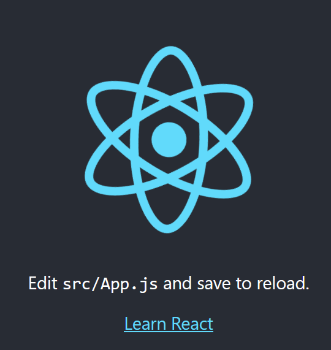

<!--## (Optional) Custom domain-->

# Advantages of this hosting method
## 1. Very low CI/CD minutes consumed
[As stated before](#why-this-method-is-better-than-others-a-must-read), this **method is up to 9x faster** than building the app in Gitlab runners directly.

## 2. Privacy
You can keep your code private and still have your React JS app accessible to public, unlike [Github](https://docs.github.com/en/pages/getting-started-with-github-pages/about-github-pages){:target="_blank"} that <u>needs a Pro plan</u> to do so.

## 3. Custom domain
Gitlab Pages can handle [custom domains](https://docs.gitlab.com/ee/user/project/pages/custom_domains_ssl_tls_certification/){:target="_blank"} to your app, that you will have to specify in `homepage` value of the `package.json` file.

## 4. Free and highly available
Gitlab free plan is suitable for any small and medium react JS projects. Gitlab only requires your repo to be [less than 10GB](https://forum.gitlab.com/t/what-are-the-restrictions-for-gitlab-pages-sites/15067){:target="_blank"}, which is way larger than what you will need to make a great react JS app. **No need to pay to make your app work and available [more than 99% of times](https://status.gitlab.com/){:target="_blank"}**.

## 5. Customizable and easy to maintain
Everytime you deploy a new version of your app, Gitlab runs automatically the config file. You can also configure your [.gitlab-ci.yml file](#5-create-gitlab-ciyml-file-for-cicd) to [deploy pages only manually](https://about.gitlab.com/blog/2021/05/20/dag-manual-fix/){:target="_blank"} for example.
Afterwards, all you need to do is to monitor and check that everything works fine !

Any thoughts on this method 🤔 ? Feel free to comment or to ping me on Twitter ([blog one](https://twitter.com/DataAddict_com){:target="_blank"} or [personal one](https://twitter.com/jadyrama){:target="_blank"}) !

[baseimg]: ../assets/img/2022-08-13/
[Gitlab account]: https://gitlab.com/users/sign_up
[React JS app]: https://create-react-app.dev/
[store]: #7-push-files-to-gitlab
[deploy]: #5-create-gitlab-ciyml-file-for-cicd
[host]: #10-preview-your-app
[here1]: https://medium.com/@garrick666/how-to-deploy-react-application-on-gitlab-page-with-router-ready-for-free-8b974189957
[here2]: https://jsramblings.com/continuously-deploy-a-react-app-to-gitlab-pages/
[here3]: https://forum.gitlab.com/t/notes-on-how-to-deploy-react-app-on-gitlab-pages-using-ci-cd-feature/47092

