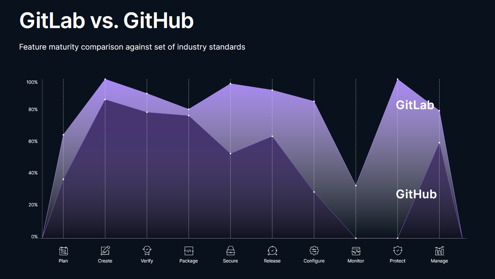

**Have you ever heard about Gitlab and Github and never knew what the differences are** ?   
This article is going to compare them, and explain why Gitlab is (sometimes) better than Github.   
If you don't want to read few explanations of keywords, [jump right into gitlab advantages](#why-you-should-choose-gitlab).

* TOC
{:toc}

# Cautions
The whole following statements are **only based on my personal experiences**. I use both platforms on a daily basis, and I **litteraly love both of them**. The only article goal is to tell why sometimes choosing Gitlab is a smatter solution.

# Common points
## Definitions
See down below the both definitions from Wikipedia.

**Github** : 
> GitHub, Inc., is an Internet hosting service for software development and version control using Git. It provides the distributed version control of Git plus access control, bug tracking, software feature requests, task management, continuous integration, and wikis for every project.

**Gitlab** :
> GitLab Inc. is an open-core company that provides GitLab, a DevOps software package that combines the ability to develop, secure, and operate software in a single application.

In practice, both platforms can handle many common tasks, but sometimes one is better than the other depending on the goal of your project.

## Few common points
- **Repositories** : each project you create is stored as a repository, where you can :
	+ host the source code and (probably) a [readme file](https://en.wikipedia.org/wiki/README){:target="_blank"} ;
	+ handle version controls and workflows ;
	+ monitor your project.
- **Git CLI** : you need to install [the Git terminal](https://git-scm.com/downloads){:target="_blank"} to handle installation and configuration processes. Both of them use the same terminal.
- **REST API** : you can manipulate anything from your account by using access tokens and REST APIs.
- **Users and organizations** : you can group multiple users into a same organization to simplify your project management and make it collaborative.
- **Pages** : you can host a static website for free by adding your static files directly (**HTML**, **CSS**, **JS**).
> Learn [how to host your react JS app in Gitlab pages for free](/create-and-deploy-react-JS-app-for-free){:target="_blank"} !
- **Open-sourceable** : you can share your whole project publicly so that people can contribute.
- **Reliability** : you don't have to think about privacy issues, security matters, vulnerabilities detection or even dependancies deprecation - both are able to handle all of that.
- **Automation** : you can automate jobs, for example a deployment after pushing your code, or at a certain period of time (**schedulable pipelines/workflows**).
- **Caching** : when a pipeline is over, some **artifacts** may be created. These are the files that your pipeline jobs may have outputed. You can specify the final path of artifacts in your caching management.
- **Uptime guarantee** : your hosted app will be more than 99% reachable.

# Main differences
- **Users access** : Gitlab is way more customizable in terms of user's access, depending on user's profile, role, etc.
- **Terminology** : both have their own vocabulary for the same things. He are few examples (Gitlab VS Github ordered):
	- **Merge request** VS **Pull request**
	- **Snippet** VS **Gist**
	- **Project** VS **Repository**
	- **Group** VS **Organizations**
	- **Pipelines** VS **Workflows**
- **Pipelines**/**Workflows** : they are a group of jobs for Continous Delivery/Continous Integration (**CD/CI**). <u>Gitlab pipelines</u> is customizable from scratch, whereas <u>Github workflows</u> rely on only third party tools ([Jenkins](https://www.jenkins.io/){:target="_blank"}, [CircleCI](https://circleci.com/){:target="_blank"}, ...) through Github Actions.
- **Community** : Github has a way bigger and more active community. Open-source projects are generally hosted in Github than Gitlab.

# Why you should choose Gitlab
There are many **reasons to choose Gitlab as a solution**, here are **5 of them** :
- (1) **<u>Free private pages</u>** : Gitlab free plan includes [private Gitlab pages](https://docs.gitlab.com/ee/user/project/pages/pages_access_control.html){:target="_blank"}, whereas Github pages needs [the repo to be public](https://docs.github.com/en/pages/getting-started-with-github-pages/about-github-pages){:target="_blank"} unless you subscribed to a Github Pro plan.
- (2) **<u>CI/CD advanced features</u>** : as stated in [the main differences](#main-differences), you can customize your pipelines to whatever you need. Here are few features that only Gitlab has :
	+ Set up a **same workflow for multiple projects**, by storing in a whole different repo ;
	+ **Preview app** before deployment to reduce side effects ;
	+ Run a **single job from pipeline manually** to monitor your workflow.
- (3) **<u>Industry compliancy</u>** : Gitlab has more features that makes it way more efficient than Github.

> Source: [Gitlab VS Github in Industry standards](https://about.gitlab.com/why-gitlab/#chart){:target="_blank"}

- (4) **<u>Hostable</u>** : you [can host your own gitlab platform](https://about.gitlab.com/solutions/open-source/){:target="_blank"}, using your own policies. For example, only users with **...@company.com** mail address can have access to **gitlab.company.com**.
- (5) **<u>High Availability</u>** : the servers availability increases as the number of users is rising. They explained how it works in [their official website](https://docs.gitlab.com/ee/administration/reference_architectures/){:target="_blank"}.

# Final thoughts
If you need to deploy a **reliable and customizable app** that is **not necessarily open-sourced** with a lot of **[DevOps](https://en.wikipedia.org/wiki/DevOps){:target="_blank"}** processes, choose <u>Gitlab</u>.   
If you want to **deliver fast** with **all-ready solutions** and an **active community**, especially in **open-source projects**, choose <u>Github</u>. 

# They also compared each other !
Both platforms actually released a very interesting comparison of each other. You can check out [Gitlab's one here](https://about.gitlab.com/devops-tools/github-vs-gitlab/){:target="_blank"} and [Github's one here](https://resources.github.com/devops/tools/compare/#compare-gitlab){:target="_blank"}.

[baseimg]: ../assets/img/2022-08-13/