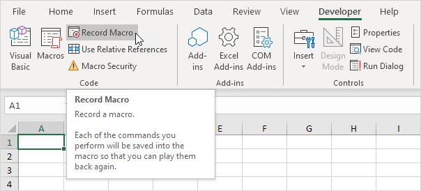
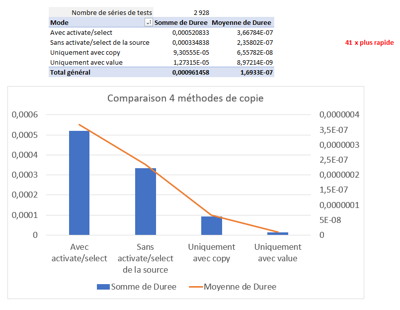
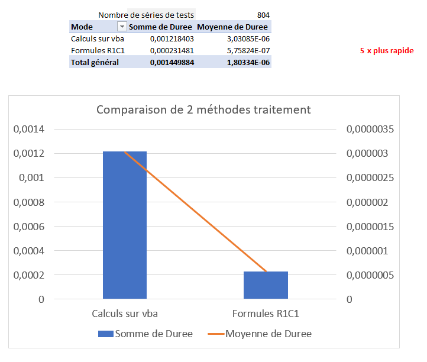
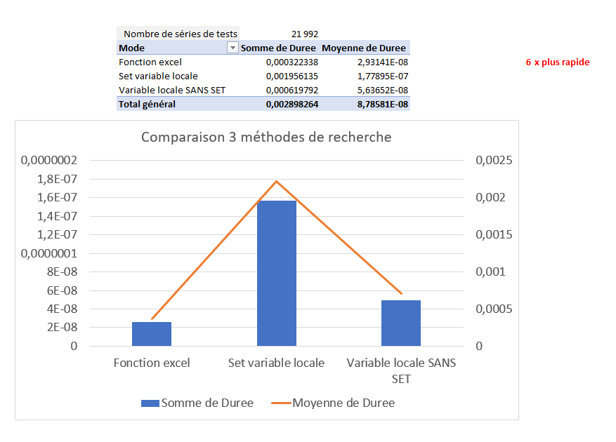

Automation to save time is great. **Optimization** in order to minimize the execution time, it's better ! I'm going to prove to you that by applying [my tricks](#my-tricks), we can **divide the execution time up to 41x** 🤯.
> Even myself was pretty amazed by this insight.


* TOC
{:toc}


## My tips
### 1. Avoid the **.Activate** method
Even if the **recorder** helps to create a VBA macro without necessarily knowing how to code...


... Well it's **not quite optimal** to stop there !

In fact, the recorder will transcribe **each of your manual actions**, in particular the fact of selecting a sheet by the **Activate** method. However, this method is useless in the code, because it is a **purely graphical manipulation** so that you have the data in front of your eyes. The machine (therefore the code) does not need it.

### 2. Avoid the **.Select** method
A range of data is often selected to make a copy (**.Copy** on the recorder), or to insert a value into it. Again, this selection is an **unnecessary graphical manipulation for the code**. Use only "**.Value =**" to assign the value of a data range.

### 3. Use **native functions of Excel Application.WorksheetFunction** with **R1C1** instead of loops
Speaking of assigning values, it is common that the value to put depends on another cell. Rather than processing the values to be calculated line by line, consider the [R1C1 formula solution](https://docs.microsoft.com/en-us/office/vba/api/excel.range.formular1c1){:target="_blank"}.

### 4. Use **internal arrays** instead of cells
We will often iterate line by line or column by column... But again, looping on **graphic** elements such as cells is very time-consuming.
The solution ? **Store** the values of the range to process **in a local variable**. We will see a little later how in [the optimal method to keep in mind](#the-optimal-method-to-keep-in-head).


## With and without these tricks : the comparison and the results
I set up **4 types of tests**:
### a) Copy of value : **x41 optimization**

On almost **3000** series of tests, we realize that not using **.Activate** and **.Select** already divides the execution time by 2, and coupled with the assignment "* *.Value =**” instead of the **.Copy** method, we have the **factor 41 between the most and the least optimal**.
### b) Insertion of several values : **optimization x1.6**
On **52000 inserted cells**, we realize that it is better to first **gather the data in a local table** before putting them in a data range : this is the ** massive insertion**. You save **1.6x** more time, and on big data, it can really make a difference.
### c) Simple calculations : **optimization x5**

The **800 test calculations** consisted of summing a large number of values, either by doing the **calculations on VBA**, or by using **R1C1 Excel formulas**.
As I said in [tip number 3](#3-use-the-native-dexcel-functions-with-r1c1-instead-of-loops), we see here that exploiting the features from Excel directly is **5x** faster.
### d) Search for value : **optimization x6**

The experiment is to search for a value very far in the spreadsheet. I tested 3 methods : Excel's **native search function**, copy ranges of values to search **with Set** and **without Set**. The result is obvious : the **native function is 6x better**.
> **Set** is used to configure a variable so that it is updated with its reference. <u>Example</u> : ```Set value_of_a1 = Range("A1") ``` : if we update the value of cell A1 in Excel, then ```value_of_a1.Value``` will return this new value.

## THE optimal method to keep in mind
If you have to remember 3 things, they are these points:
- Do **NOT** (or no longer) use : .**Activate**, .**Select**, .**Copy**
- Favor **Application.WorksheetFunction** and **assignment by R1C1 formula** with **.Value =**
- **Store** the **data ranges** to be processed in a **local variable** so as not to iterate directly on the cells.

## Concrete example
We want to copy the **value of A1 of sheet 1** in **lines A1 to A5000 of sheet 2**, specifying to the copy <u>the line number of sheet 2</u> .
### Before

Sub before() 'execution time : 22 seconds

	Worksheets(1).Activate
	Worksheets(1).Range("A1").Select
	Selection.Copy
	Worksheets(2).Activate
	    
	For i = 1 TB 5000
	Worksheets(2).Range("A" & i).Select
	ActiveSheet.Paste
	ActiveCell.Value = ActiveCell.Value&"row"&i
	Next
	        
End Sub


### After

Sub after() 'execution time : less than 1 second
	
	'declare local variables of explicit names
	Dim value_to_copy As String
	Dim final_value As String
	dim copy_range as string

	copy_range = "A1:A5000"
	    
	'store in variable without Set
	value_to_copy = Chr(34) & ThisWorkbook.Worksheets(1).Range("A1").Value & "row" & Chr(34)

	'use the native function =ROW(cell) of Excel
	final_value = "=" & value_to_copy & " & " & "ROW(RC1)"
	ThisWorkbook.Worksheets(2).Range(copy_range).FormulaR1C1 = final_value
	    
	'overwrite formulas with values
	ThisWorkbook.Worksheets(2).Range(copy_range).Value = ThisWorkbook.Worksheets(2).Range("A1:A5000").Value
	    
	    
End Sub


And results:
- No **loops**
- No **unnecessary graphical manipulation**
- Code **commented** and with **declared local variables**
- **Easy maintenance** by just changing the value of ```copy_range```
- **22x faster**

> You can get the workbook containing these 2 functions ```before```/```after``` [here](/assets/examples/before_after.xlsm){:target="_blank"}.


## Test source code
I've automated all these tests, and I'm making them available to you if you want to take a look : [it's over here and it's free](https://drive.google.com/uc?export=download&id=1gpglbLfgdEhoyH2QRt0D_mQxi1CkIwMj){:target="_blank"} !


[baseimg]: ../assets/img/2022-08-16/
