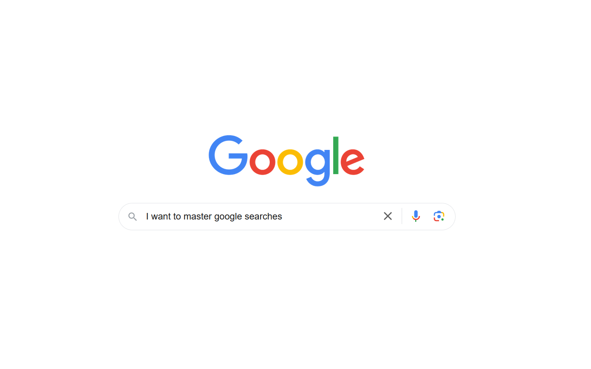

* TOC
{:toc}

When you search for information on Google, it is sometimes complicated to verify its veracity. For example, many sites will claim with "research has proven that..." - without actually mentioning the researchers.

To avoid that, let me introduce you my **5 tricks to make better Google search results**.

# The tricks
## 1. `site:example.com`
By specifying the domain in which you want to search on, you define the website in which you trust. You can also use this keyword by specifying that part of the domain name, for example `site:wikipedia` or `site:.gov` → this allows you **to target a specific entity** without having to know the exact domain name.

## 2. `"required keyword"`

Sometimes Google finds content that doesn't even contain the keyword you typed in. **To force the existence of your keyword in the final search results**, surround it with quotes, and voila !

## 3. `-prohibited`

If you want **to avoid a specific keyword** in your search results, use the `-` symbol to disallow it. For example, the following search `Mark Zuckerberg -facebook` divides the number of results by 7, therefore my research is more targeted and precise:

![Before prohibited keyword][before]

![After prohibited keyword][after]

## 4. `filetype:pdf`

If you want **to specify a specific type of document**, use the keyword **`filetype`**. For example, this can be very useful for finding PDF forms to fill out for taxes, visa applications, etc.

## 5. `@username`

Ever wanted **to know anyone's social network** ? To do so, you can use the at sign (`@`) followed by their possible username. A website is considered as a social network when the user has to register to access the platform's services. Facebook, Twitter, Linkedin, Pinterest, Spotify, Tiktok, etc.

# Bonus tricks
## Bonus #1
Don't use capital letters. **Capital letters do not change anything in a Google search**. Whether you type LINKEDIN or linkedin, the results will be the same.

## Bonus #2
Use advanced search. You can use the **`Tools`** option to be more specific on your search. For example, the `Mark Zuckerberg` search can be filtered to get only his verbatim.

![Advanced google search with Tools option][advanced]

# Final words
If you found this article useful, please feel free to share, comment, or just [ping me on Twitter](https://twitter.com/jadyrama){:target="_blank"}.

That's all for today, folks !

[baseimg]: ../assets/img/2022-08-26/
[before]: ../assets/img/2022-08-26/before.png
[after]: ../assets/img/2022-08-26/after.png
[advanced]: ../assets/img/2022-08-26/advanced search.png