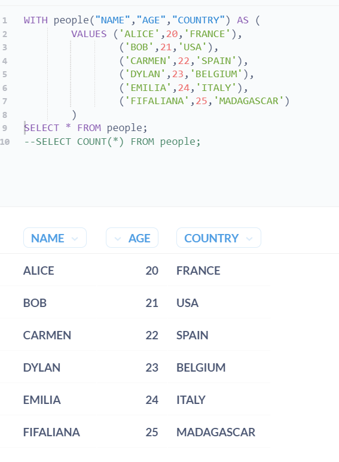
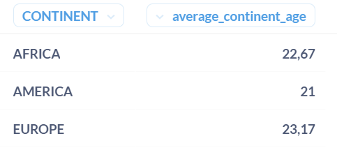
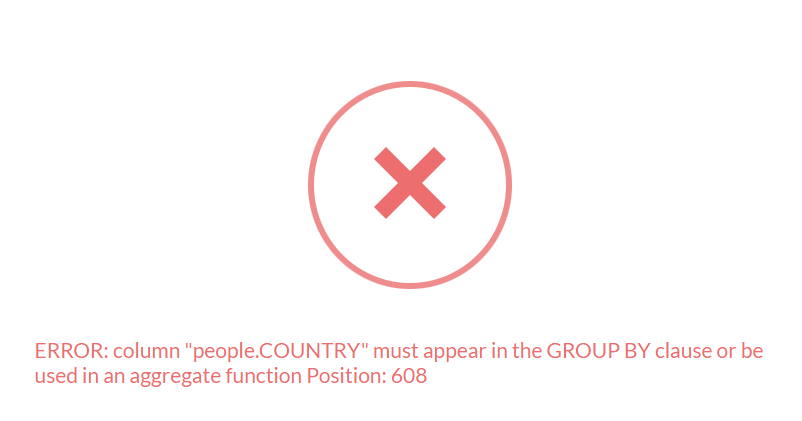
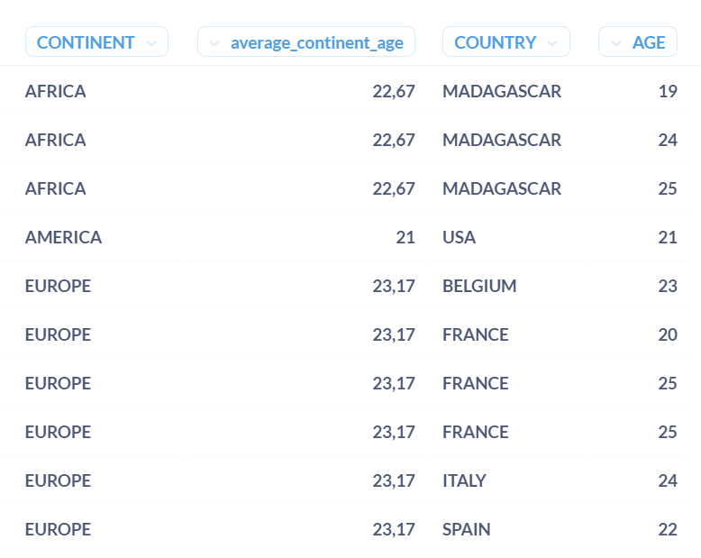
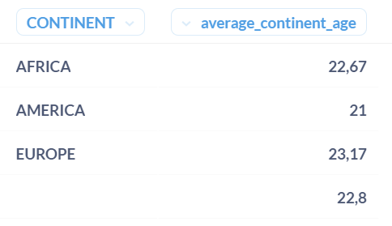
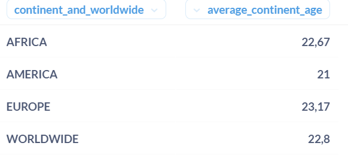

* TOC
{:toc}

We will not talk about simple queries like `SELECT ... FROM ... WHERE ... GROUP BY ... ORDER BY ...`.    
If you need some help with those previous syntaxes, you can search for [tutorials on youtube](https://www.youtube.com/results?search_query=sql+tutorial){:target="_blank"} instead.   
We will rather focus on few SQL tips that are **not that common**, that even myself (as a Data Analyst) found out very recently.    
They are actually really useful, and that is the reason why I wanted to share them here.
> And to be honest, I would like to archive them so that I can go back to my own article for self-documentation).   

Let's get right into it !

# What you will need to test those tips
You will need a **read-access** to a **postgres database**.   
In these tips, we will use the following simple CSV that has 3 fields : `NAME`,`AGE`,`COUNTRY`
```
NAME,AGE,COUNTRY
ALICE,20,FRANCE
BOB,21,USA
CARMEN,22,SPAIN
DYLAN,23,BELGIUM
EMILIA,24,ITALY
FIFALIANA,25,MADAGASCAR
```
NB : Datas may differ from a tip to another, but the data structure will remain the same.

# The tips
## 1. Common Table Expressions, aka **`CTE`**
Just remember the syntax : **`WITH...`**.   
Yeah, it is that simple ! 

### Usecase #1 : store datas in a question without a table in [METABASE](https://www.metabase.com/){:target="_blank"}
> If you are not familiar to metabase, just [skip this usecase](#usecase-2--factor-to-avoid-repetition-in-your-calculated-fields).   

There might be times where you need to store some datas somewhere in your database, but for some reason you don't have write-access to do so. Maybe you need to wait for a developer to manage it, or maybe you don't know how to import it manually... No matter what the reason is, there is actually a workaround for that, especially if you know exactly which structure and datas you want to store !    
Here is the syntax to do the CTE with [our previous datasets](#what-you-will-need-to-test-those-tips) :    
```
WITH people("NAME","AGE","COUNTRY") AS (
		VALUES ('ALICE',20,'FRANCE'),
				('BOB',21,'USA'),
				('CARMEN',22,'SPAIN'),
				('DYLAN',23,'BELGIUM'),
				('EMILIA',24,'ITALY'),
				('FIFALIANA',25,'MADAGASCAR')
		)
SELECT * FROM people;
```
where :
- `people` is the **fictional table** name;
- `NAME`, `AGE`, `COUNTRY` are the fields.

It looks like the [`INSERT`](https://www.postgresql.org/docs/current/sql-insert.html){:target="_blank"} syntax, right ?   
Once we run it in metabase SQL editor, it will look like this :


Once you save this query as a question in metabase, you can [use it later as a subquery](https://www.metabase.com/docs/latest/questions/native-editor/sql-parameters){:target="_blank"}. It finally looks like you just created a **fictional table** !


### Usecase #2 : factor to avoid repetition in your calculated fields
Let's assume that you already have a table named `people` with the [previous datas](#what-you-will-need-to-test-those-tips).   
The goal is now to calculate a field, and add a condition on this new calculed field.    
For example, let's calculate the year of birth of every person, then keep only the records where this calculated year is an even number.   
Without CTE, you may use this syntax:
```
SELECT *, (2023-"AGE") as YEAR_OF_BIRTH
FROM people
WHERE  (2023-"AGE") % 2 = 0
```
In this syntax, as you won't be able to immediately write `WHERE YEAR_OF_BIRTH % 2 = 0`, you have to repeat the calculated field formula in the `SELECT` and `WHERE` parts. To factor that, you can use a CTE as follows:
```
WITH CTE as (
	SELECT *, (2023-"AGE") as YEAR_OF_BIRTH
	FROM people
)
SELECT *
FROM CTE
WHERE YEAR_OF_BIRTH % 2 = 0
```
You may wonder how the heck is this factoring ? Well, imagine a very complicated calculated field instead of `YEAR_OF_BIRTH`: if you ever need to change its formula, you will only have to do it once (in the CTE definition), and not in `SELECT` and `WHERE` parts. Trust me, you will thank me later.

### Usecase #3 : use a more human-understandable query containing a subquery
In general, you make a subquery this way:
```
SELECT DISTINCT COLUMN_1
FROM (
	SELECT *
	FROM SOME_TABLE
) SUB_QUERY
```
The first `SELECT` statement that will be executed is the wrapped one (the subquery). Meanwhile, if we read it upside down as a human, we first see the final query and it may lead to misunderstand how it actually works. To solve that, CTE can make subquery statement more understandable :
```
WITH SUB_QUERY AS (
	SELECT *
	FROM SOME_TABLE
) SELECT DISTINCT COLUMN_1
FROM SUB_QUERY
```
Here, it first executes the `SUB_QUERY`, then from it, it will retrieve the `DISTINCT COLUMN_1`.

## 2. `PARTITION BY`
It's another way to aggregate datas instead of using `GROUP BY`. It is also known as a window function. The syntax is :
```
AGGREGATE_FUNCTION(field1) OVER (PARTITION BY field2, field3, ...)
```

### Pros
- In your select statement, you can add as many new fields as you want without grouping your query by them
- The syntax is clear : you know by which fields you want to calculate the aggregated values
- Each calculated field can be partitionned by different fields in the same query, which is impossible with a `GROUP BY`. For example :
```
SELECT AGGREGATE_FUNCTION(field1) OVER (PARTITION BY field2, field3) as calculted_field,
	   AGGREGATE_FUNCTION(field1) OVER (PARTITION BY field4) as another_calculted_field
FROM TABLE_NAME
```

### Cons
- You **can't** count **distinct** values by using `PARTITION BY`
- You may forget why your calculated field doesn't work as expected because you forget a field in your partition
- You can't use [`ROLL UP`](#3-roll-up) : you will have to use `GROUP BY` for that

### Example


For example, we want to know the average age from each continent of the following datas:
```
NAME,AGE,COUNTRY,CONTINENT
ALICE,20,FRANCE,EUROPE
AINA,24,MADAGASCAR,AFRICA
BOB,21,USA,AMERICA
BASTIEN,25,FRANCE,EUROPE
CARMEN,22,SPAIN,EUROPE
DYLAN,23,BELGIUM,EUROPE
DIAMONDRA,19,MADAGASCAR,AFRICA
EMILIA,24,ITALY,EUROPE
EUGENE,25,FRANCE,EUROPE
FIFALIANA,25,MADAGASCAR,AFRICA
```
Here is the query with a `GROUP BY`:

```
SELECT "CONTINENT", AVG("AGE") as average_continent_age
FROM PEOPLE
GROUP BY "CONTINENT"
ORDER BY "CONTINENT"
```

Here it is with a `PARTITION BY`:
```
SELECT DISTINCT "CONTINENT", AVG("AGE") OVER (PARTITION BY "CONTINENT") as average_continent_age
FROM PEOPLE
ORDER BY "CONTINENT"
```
NB : it will only work properly with `DISTINCT`, otherwise every continent is repeated as much as the number of its countries !

In both ways, we have the same results :


Now, let's try to see which countries are part of this calculated age average.   
From the `GROUP BY` syntax, if you ever add the `COUNTRY` field in the `SELECT` part, you will **have to** add `COUNTRY` in the `GROUP BY` part, which is not always what we want :


We would rather view which countries and ages are represented to calculate the average age **over the partition of each continent**.   
Here is the solution with `PARTITION BY` :
```
SELECT DISTINCT "CONTINENT", AVG("AGE") OVER (PARTITION BY "CONTINENT") as average_continent_age, "COUNTRY", "AGE"
FROM PEOPLE
ORDER BY "CONTINENT", "COUNTRY",  "AGE"
```


See how the `average_continent_age` doesn't change no matter what the country is ? If you want to know how an aggregated field is computed, this is a very powerful way to understand how your datas are used for the calculation. 


## 3. `ROLL UP`
You can only use `ROLL UP` with `GROUP BY` (no `PARTITION BY` possible).   
Let's take the same [datas as in tip #2](#example).   
Let's assume that we want to add a new row called 'WORLDWIDE' that has the average age in all continents, in addition to the average age in each continent.
```
SELECT "CONTINENT", AVG("AGE") as average_continent_age
FROM PEOPLE
GROUP BY ROLLUP("CONTINENT")
ORDER BY "CONTINENT"
```
And here are the results with the worldwide row :


The [next tip](#5-coalesce) will show you how to replace the empty (aka `null`) value of `CONTINENT` into 'WORLDWIDE'.

## 4. `NULLS LAST`
In the `ORDER BY` part, you can add this to display non null values first.
```
SELECT *
FROM PEOPLE
ORDER BY "CONTINENT" NULLS LAST
```
Anyone with a null value of `CONTINENT` will always be displayed at the end of your selected datas.

## 5. `COALESCE`
This tip is probably the most known among them all. But nevermind, some people may never heard about it !   
To replace `null` values with an actual value, you can use `COALESCE(fieldname, 'replacement_value')`.   
For example, let's take those datas :


In your SELECT statement, you can replace `SELECT "CONTINENT"` with `SELECT COALESCE("CONTINENT",'WORLDWIDE') as continent_and_worldwide`, and here are the results :


It can fill up your empty datas without having to replace the raw ones !   


If I introduced just even one new SQL syntax to you, that's enough for me to keep writing down those articles. Feel free to share or leave a comment !
