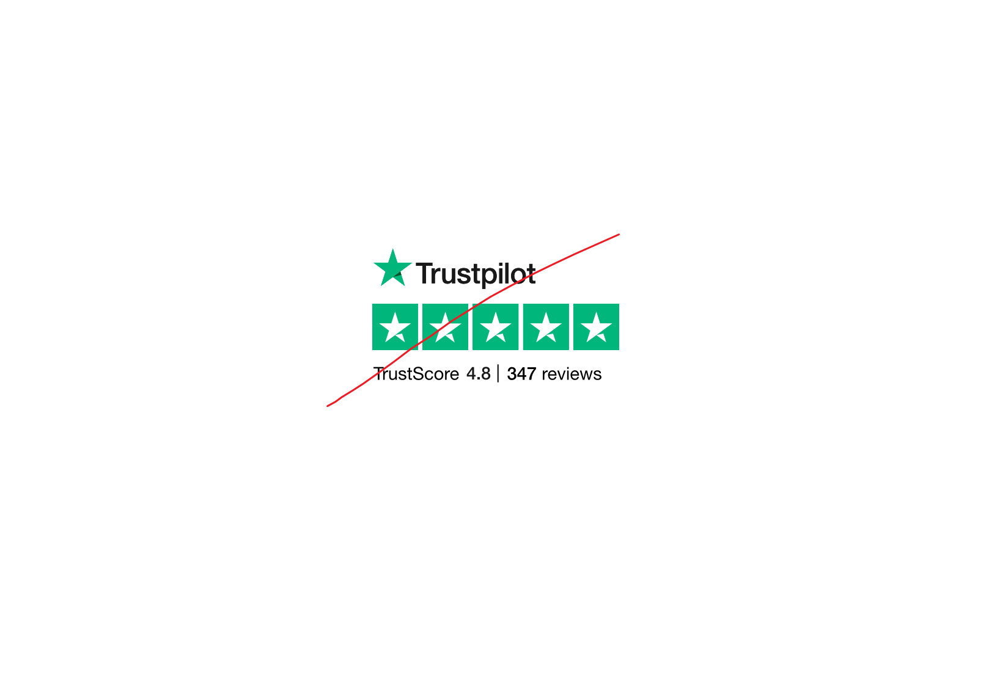

When it comes to **make a choice** between possible options (for restaurants, hotels, ...), we kinda all have this reflex of going to see the reviews on Google. It naturally redirects us to different reviews systems such as [Google Maps](https://maps.google.com){:target="_blank"}, [Tripadvisor](https://www.tripadvisor.fr/){:target="_blank"}, or ... **[Trustpilot](trustpilot.com){:target="_blank"}**.   

In this article, I will focus on **Trustpilot** and I will show you why **I don't trust this platform anymore**. It claims to be objective, but in fact, **it is far from being so**, and let me explain why. 

* TOC
{:toc}

# Backstory
Recently, I've been looking for a good **orthodontics company** to straighten my teeth. It's been 10 years since I wanted to do so, and I was finally ready. There were a lot of possible companies, but there was one that always appeared in my researches. Let's call it **The famous orthos**.

The tricky thing is that they had a **very good average reviews** (4.5/5 at the time). However, when I read the detailed feedbacks, most of them were unsatisfied clients that warned people to avoid their services.    

Since then, I wondered : **how accurate were those feedbacks ?**   
To answer that, there will be 3 criterias for a feedback to be accurate (in my personal opinion, **it might differ from your perspective**):
- There is a feedback comment in the review (at least one character)
- The reviewer has more than one review in his/her profile
- The reviewer is in the same country as me

But now, the most important part of this is : **how can I gather the thousands of feedbacks with less effort** ?   
The answer is : **[web scraping](https://en.wikipedia.org/wiki/Web_scraping){:target="_blank"}**.

# Goals of the experience
## Generalization
My actual situation was quite common. Maybe not in orthodontic field, and maybe not for only me. **Anyone that wants to challenge reviews they find on Trustpilot should be able to reproduce this experience**.

## Awareness of companies practices 
Companies might use anything they can to gain your trust. In our case, we will see how inacurrate was the 4.5/5 rate in my context.

## Reviews sources
This will hopefully make you understand how important it is to **check the reviews sources**, and to ask yourself how accurate it is to make your own decision.

## And of course...
For my **personal fun** ! 

# Gathering the datasets
If you wonder how technically I proceeded, you can jump to the [detailed section about it](#do-it-yourself).

Here are the raw data scraped :
![Raw data from excel][rawdatas]

> Yeah, the column names are in french. And yeah, the `response date` is always empty, but nevermind, we can go with it !

Interesting right ? Well, we can't deduce anything at the moment. The most exciting part is now !

# Results
## Few verifications
To make sure everything worked fine during scraping, let's check :   
- the number of reviews 
	- overall : **3720 rows** in the excel file
	- per page : **20 rows** in average, except the first one (only 8 of them are displayed in Trustpilot)
- the reviews score histogram : kind looks like the one in Trustpilot   

![Reviews summary in trustpilot][trustpilot-reviews-summary]
![Reviews summary in scraped data][data-reviews-summary]

Now that our data look okay, let's analyze them deeper.   
As stated before, these 3 criterias will make a review reliable :
- There is a feedback comment in the review (at least one character)
- The reviewer has more than one review in his/her profile
- The reviewer is in the same country as me

Now we are good to get into serious things !

## Reviews for this orthodontics company are not that good
I'm gonna get right to the point : **this company is scamming its reviews**. Actually, I found so many things but I will just talk about 3 of them.

### 1. Less than 1% of my three criterias were found
Most of the reviews (99.5% of them) are :
- without any comment written down
- AND from reviewers who use Trustpilot for the very first time
- AND not from France

Visually, that means that the only reviews that I was interested in are the first one among the 7 possible scenarios :
![7 scenarios found in data][reviews-evolution]

### 2. From 3700+ reviews to 10 left
If I keep my three criterias, it will only keep 10 reviews out of the 3720 collected. In fact, most of them were complaining. See **how false it is to immediately accept the 4.5/5 average score displayed on the company's Trustpilot page** ?

### 3. They massively imported reviews 3 times
As you can see in previous screenshot, there are 3 picks of good reviews :
- 07 oct 2020
- 21 oct 2021
- 21 dec 2021

They were probably running some commercials at the same period, so they needed to get good reviews asap to make people follow their orthodontics program. How can I be so sure ? Because most of them are the first ratings from reviewers.

## FUNFACT : Trustpilot use Lorem Ipsum to hide problematic reviews
In my data :   
![Lorem ipsum review showed in data][loremipsum2]   

On the website :   
![Lorem ipsum review showed in Trust Pilot][loremipsum]

## Let's take another example : Google translation
You can discover it directly at my [Tableau Public dataviz](https://public.tableau.com/app/profile/ramanandray/viz/Trustpilot_17086711974050/Reliablereviewornot){:target="_blank"}, that you may clone for the DIY.

# Do it yourself 
Here is what you will need :
- [Web Scraper](https://webscraper.io/) extension installed   
- Stable internet connection (I mean, of course)   

And voilà !

## Step 1 : install and open the Web Scraper in your browser console
![Web Scraper Console screenshot][ws]

## Step 2 : import a new site map
![Web Scraper import][import-sitemap]

## Step 3 : copy the script
You can get the [sitemap JSON content here](../assets/files/sitemap_sample.json){:target="_blank"}.   

Copy the whole content in the `sitemap JSON` field.   
And this is how it should look like :
![Final results of the sitemap import][import-result]

In your case, **you will have to change 2 values** :   
- a) **COMPANYNAME**    
Replace it with the exact name of the company you're searching for in Truspilot. In my case, it's **The_famous_orthos_com** in the `_id`, and **thefamousorthos.com** in the `startUrl`. Then, the `Sitemap name` will show up automatically.   
- b) **LASTPAGEINDEX**   
	- Go to Trustpilot reviews page : `https://fr.trustpilot.com/review/COMPANYNAME?languages=all&sort=recency` **with changing COMPANYNAME with the real name on trustpilot**
	- Replace **LASTPAGEINDEX** from your sitemap JSON with the last page index, **at the bottom of the page**. In my case, as shown below, it's 189.

![LASTPAGEINDEX from Trustpilot][lastpageindex]

Now, click on `Import Sitemap`.

## Step 4 : run the scraper
![Sitemap xxx then Scrape][run1]
![Run with default values (2000ms)][run2]   

Click on `Start scraping`, then wait for the magic to happen !

## Step 5 : download the data, and make the dataviz

![Sitemap xxx then Export data][download] 

Choose the xlsx format, as it handles comas that may be present in your scraped data.   
To make the dataviz, you can duplicate my [Tableau Public dataviz](https://public.tableau.com/app/profile/ramanandray/viz/Trustpilot_17086711974050/Reliablereviewornot){:target="_blank"} and replace the data with your own.

# Limits
## The more reviews, the more it takes time
For 189 pages scrapped, it took about 30 minutes to gather the whole data. It's about 4k rows that makes 1Mb excel file.

## HTML structures may change 
If Trustpilot pages structures ever change, I/you will have to maintain the whole webscrapper script (but it **still works in february 2024** though).

## Unexpected scraping conditions
- **Rate limits** : change timeout parameters
- **IP bans** : too fast, change timeout parameters or reload your box and PC
- **Unstable internet connections** : make sure you won't have a service interruption
- **PC on standby** : if you leave the computer scraping on its own, make sure it doesn't go on standby mode

## Legal uses
If you only use this script for **personal purposes**, it is totally fine. However, if you want to use those data for commercial purposes, it might be illegal depending on your country law. If you do so, I'm not responsible of any of your acts.

# How to trust back the platform ?
Actually, the Trustpilot concept is good : help people to make a decision based on what other people said. The thing is, fake testimonies should be prohibited or at least limited.
As a workaround, you can :
- apply the **filter to show up only verified reviews**
- show only **feedback in your language**
- call the company to explain reviews you don't understand (not sure they will respond though...)

I hope this article convinced you to be more aware of reviews sources !

> NB : I actually made this experience AFTER signing my orthodontics treatment with **The famous orthos** 😂 I hope my storytelling made you captivated though !

[ws]: ../assets/img/2024-02-23/ws.png
[import-sitemap]: ../assets/img/2024-02-23/import-sitemap.png
[lastpageindex]: ../assets/img/2024-02-23/lastpageindex.png
[import-result]: ../assets/img/2024-02-23/import-result.png
[rawdatas]: ../assets/img/2024-02-23/rawdatas.png
[trustpilot-reviews-summary]: ../assets/img/2024-02-23/trustpilot-reviews-summary.png
[data-reviews-summary]: ../assets/img/2024-02-23/data-reviews-summary.png
[loremipsum]: ../assets/img/2024-02-23/loremipsum.png
[loremipsum2]: ../assets/img/2024-02-23/loremipsum2.png
[run1]: ../assets/img/2024-02-23/run1.png
[run2]: ../assets/img/2024-02-23/run2.png
[download]: ../assets/img/2024-02-23/download.png
[nb-reviews-per-score-evolution.png]: ../assets/img/2024-02-23/nb-reviews-per-score-evolution.png
[reviews-evolution]: ../assets/img/2024-02-23/reviews-evolution.png