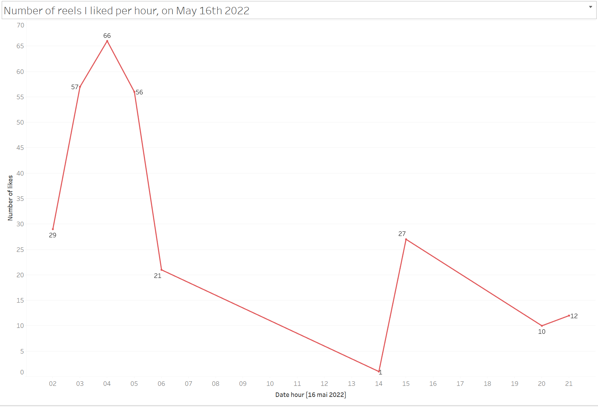

* TOC
{:toc}

# About personal datas on Instagram
On March 04th 2024, I downloaded all my personal datas on Instagram: a 500MB zip file. When I dived into them, I realized I have wasted **more than 220 whole hours** on it, which is a **more than 9 whole days non-stop activity**. I am here to share this experience, and give you the opportunity to check out your own app use.

> NB : Every information about Instagram here is valid for today (March 22nd 2024), and **might change in the future**.

# What kind of information does Instagram have about me (us) ?
In this downloaded ~500MB zip file, there are my whole datas since I signed up in 2016 (second account). In fact, once unzipped there is a lot of folders that might contain JSON files (that are actually the datas I need). In some cases, there can be a single text file named `no-data.txt` in it, where it’s written :
> *You have no data in this section*.

For the rest of the article, I will focus on only provided datas (**at least with 1 JSON file**).   
As there are **A LOT of JSON files**, I made a bash script that outputs into a new text file 2 details of every JSON file:
- its `relative path` : I encrypted any personal datas within it (from personal messages for example)
- its `size` : in bytes

You can find the details of the script [in this article](/todo){:target="blank"}. For **more than 300 JSON files**, it took about 1.5 minutes to process. Note that the duration might also depend on the PC processor.

Here is the final list of all of the JSON files :

> Quite hard to know which one contains the most of your datas, right ?   

Here is a more readable version of the list, sorted by file size :

As you can see :
- `liked_posts.json` is the largest one, with 5Mbytes.
- `mesage_1.json` is the common filename that contains each conversation I had on Instagram. 1 JSON file = 1 person I reached on Instagram DMs.
- `suggested_accounts_viewed.json` means that Instagram stores every action that affirm their potential suggesions.
- `posts_you're_not_interested_in.json` stores everything that I mentionned as "Not interesting" (yeah there used to be a button for that).

# The insights that made me mad about myself
For this section, I will explore the biggest JSON file I found : the `liked_posts.json` one. It can sum up the time spent on the app, but we gotta keep in mind that the numbers should be higher for app usage (because I don't click on like button every single time I see something).

## I liked more than 20 000 contents

I created my (second) Instagram account on **September 26th 2016**, which means that the downloaded datas represent **2717 days of activity**. That means that **on average, I liked 7 different contents every single day since I signed up**. I don't even know how high this number would be if I bring it up with my previous account datas (created in 2012)...

## I spent too much time watching reels, especially in 2023

If one reel video takes me **about 40 seconds on average** (which includes seeing the video, reading comments section or even commenting on my own), I actually spent **more than 150 hours** at watching reels. It's almost **7 days in a row, day and night**.

Let's see how it looks per day :   
 

> Blue = Live video, Orange = Post, Red = Reel video

The dataviz up there shows up the **liked contents per content type through the days since I signed up**. Here are some insights that made me really questionning myself :
- Reels were officially launched in June 2020. As you can see, **it took me a whole year after their release** to actually begin to adopt them.
- **I litterally doubled my Reels consumption in 2023 (from 4977 to 9739 likes**).
- What the heck happened on [May 2022](#something-was-wrong-with-me-on-may-16th-2022) and [December 2023](#something-was-wrong-with-me-again-on-december-30th-2023) ? Liking more than 200 contents in only ONE day is insane.

I also noticed here that I'm definitely **not interested in Live videos** (in blue). I remember how I hated receiving the _`someone is live! Come see it`_ notification. Instagram finally stopped doing that (or I probably disable this notification).

## Something was wrong with me on May 16th 2022

I spent the whole night scrolling. What a shame.

## Something was wrong with me (again) on December 30th 2023

I'd rather not comment...

# Download your own datas
Everything is well explained in [an article of the Instagram Help Center](https://help.instagram.com/181231772500920){:target="_blank"}. Make sure to downlod the **json** version instead of the HTML one. It might take few hours or even days to have access to your export : they will send you an email with the download link when it's ready. It will always be a zipfile.

# Visualize your own datas and get mad (or not) about yourself too
To make all those dataviz, I used **Tableau Public**, **which is totally free**.
To begin with, you can:
- Explore [my actual dataviz](https://jadynekena.com/projets-donnees-personnelles/?id=my-instagram-activity&src=84b58af7-5bd1-427b-92f5-a7b2ee9a7b6a){:target="_blank"} in order to understand how it works (for example, the 40 seconds spent on a content is a changeable parameter)
- Duplicate the [template directly from Tableau Public](https://public.tableau.com/app/profile/ramanandray/viz/MyInstagramactivity/Dashboard){:target="_blank"}, and replace the `liked_posts.json` file with your own.

Happy discovering !