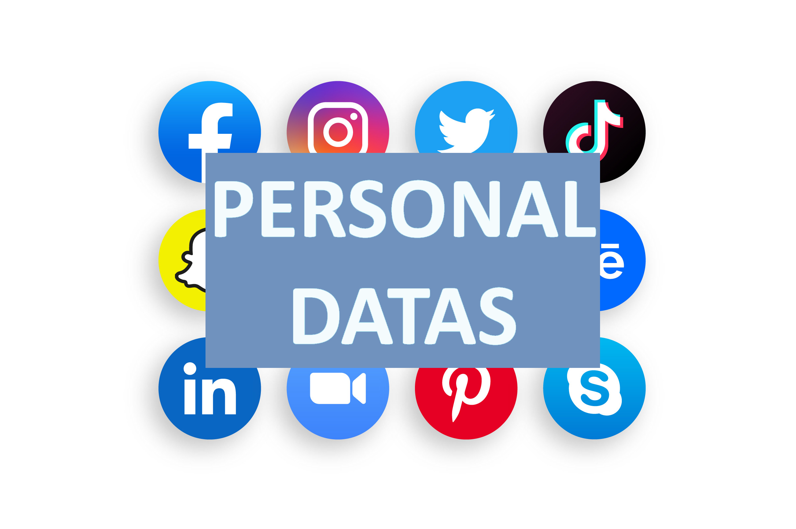
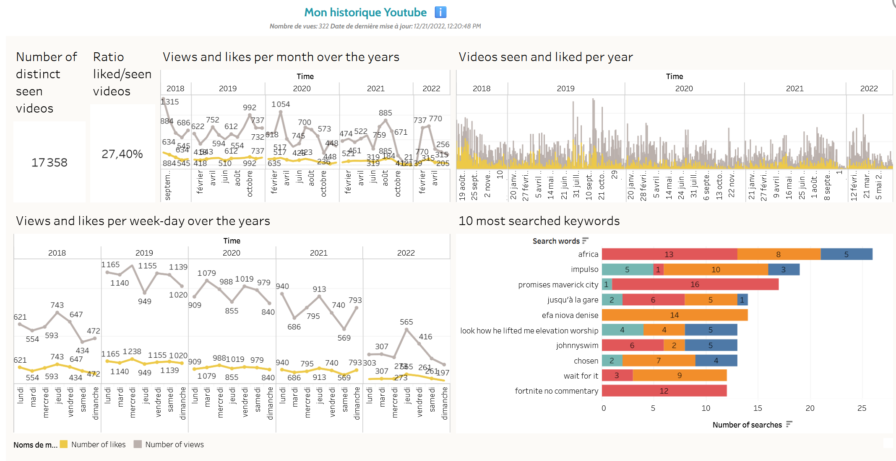
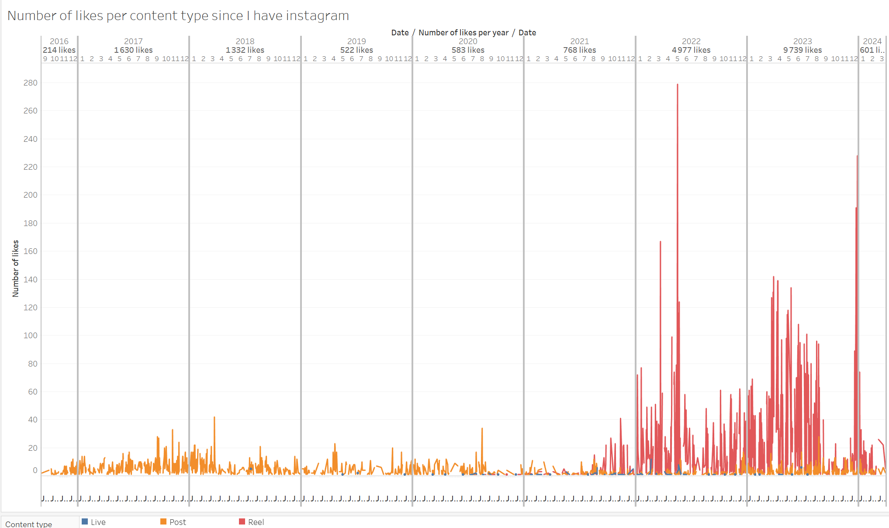
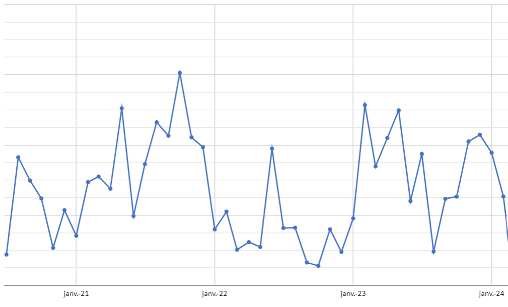

* TOC
{:toc}

# Introduction
We all have data somewhere. On a social media, on the apps we use on a daily basis, or even on our phones. But did you know that you can actually retrieve them ?   

If you're a Data newbie or just interested in your personal data online, this article might be for you.

# What is a personal data ?
**Everything that can define you on internet is a personal data**.   
It can be :
- that same **username** that you use on different platforms
- the **mail address** you use to log in
- the **GPS location** that you allow on apps
- the **IP address** of your device
... and the list goes on.   

Actually, it's more than just your basic information. Any activity you had online is stored somewhere, sometimes even when you're not logged in : the videos you liked, the music you listened to, the topics you're interested in... So yeah, the more you use an app, the more it collects data about you.

# What's the point of collecting your personal data ?
There can be multiple reasons for an app to collect your data :   
- It identifies you for must-log-in platforms (like [twitter](https://x.com){:target="_blank"} that doesn't allow reading tweets without being signed in since 2023...)
- It suggests you more relatable content, as they know what makes you stay on the app (like on [Tiktok](https://tiktok.com){:target="_blank"})
- It includes you into a targeted community for a brand commercial
- It can be used for some internal training data for AI (yeah I know, it can be scary)

That list is not exhaustive, but as you may understand : **the more data you agree to give, the better is the experience**.

# The 7 personal datasets sources you might be interested in
### 1. Youtube
You can retrieve everything about your channel activity, with timestamps on them :
- The uploaded videos : if you are a very active youtuber, it can be a very heavy export 
- The comments you made
- The videos likes you
- The playlists you created
- The channels you muted

In 2022, I created [a dataviz about my own youtube activiy data](https://jadynekena.com/projets-donnees-personnelles/?id=mon-historique-youtube&src=84b58af7-5bd1-427b-92f5-a7b2ee9a7b6a#){:target="_blank"} that looks like this :   

### 2. Instagram
Similarly to youtube, you will find the same data with few more details :
- The posts you liked
- The DMs you had
- The reels you watched
- Your followers and the accounts you follow
- The keywords you unrecommanded
- The kind of content you liked the most
- Your GPS location (even if you didn't activate it...)

[In this article](/i-will-never-spend-that-much-time-on-instagram-again){:target="_blank"} , I have shown you how **knowing my instagram activity made me stop scrolling on it**. The insights were horrifying, here is a sneak peek of a dataviz from it :   
 

> Note to myself : I will never watch too much Reels (in red) as in 2023...

### 3. Reddit or Facebook or Twitch or any other social media
You got it, any social media actually have a lot of information about you, go download your data to explore them on your own.  
For big social medias as such, the exported data are generally a zip file that contains different folders. There can be subfolders within, then you will find some JSON files that are the actual data.

### 4. Spotify or Apple Music or Soundcloud
I recently tried to download my Apple Music data, but there were nothing about it when I asked for my data through [the privacy website](https://privacy.apple.com){:target="_blank"}. But the sure thing is : **if you live in Europe, you have the legal right to download at any time your whole personal data from online platforms**.

### 5. Your own bank account
You read it right ! In general, your bank application will let you instantly download your bank transactions : as a csv or excel file. With few data cleaning and dataviz, it will help you see in which field you spend the most, and it will eventually make you spend your money more wisely.

For example, here is the amount I spent on online food ordering per month (of course I will NOT show you the actual Y axis 😜) :   

### 6. Your browser history
You may not realize it, but we all actually go on internet every single day. Whether it's for work, for studies or any random question that we have on mind, we google a lot of things. It could be interesting to explore which URLs you visit the most in a whole year.

### 7. Google maps locations
The Google maps location service should be active on your phone to make this export effective. You can go through [google takeout](https://takeout.google.com/settings/takeout){:target="_blank"} to check your own. I recently downloaded mine, and I even made a [timelapse video of my 2021 movements in France](https://www.reddit.com/r/DataArt/s/YEY1BfpxDC){:target="_blank"} (post-covid huh):
<blockquote class="reddit-embed-bq" style="height:500px" data-embed-height="739"><a href="https://www.reddit.com/r/DataArt/comments/1b6q0tv/my_google_maps_datas_rewind_2021_with_my_face_as/">My google maps data - rewind 2021 (with my face as location marker lol)</a>  by<a href="https://www.reddit.com/user/Anxious_Objective436/">u/Anxious_Objective436</a> in<a href="https://www.reddit.com/r/DataArt/">DataArt</a></blockquote>

